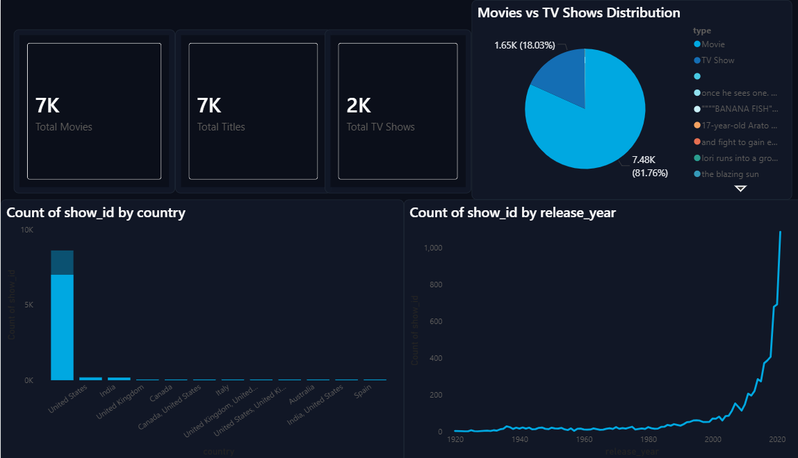
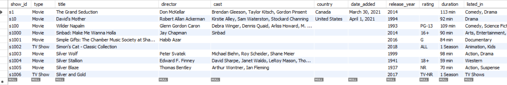
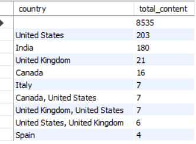
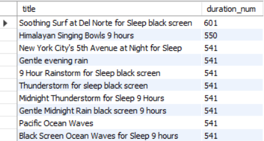
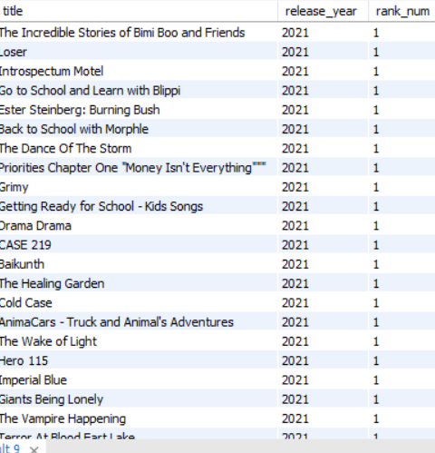

# Amazon Prime SQL Analytics Project

## Project Overview
This project analyzes Amazon Prime Video content using MySQL and SQL analytics techniques. The project includes data cleaning, exploratory data analysis (EDA), feature engineering, business problem solving, and advanced SQL queries.

The objective of this project is to extract meaningful insights from the Amazon Prime Movies and TV Shows dataset while demonstrating practical SQL skills used in real-world analytics workflows.

# Power BI Dashboard


---

# Tools & Technologies Used
- MySQL
- SQL
- MySQL Workbench
- GitHub

---

# Dataset Information
The dataset contains information about Amazon Prime Movies and TV Shows, including:

- Title
- Director
- Cast
- Country
- Date Added
- Release Year
- Rating
- Duration
- Genre
- Description

---

# Project Structure

```text
amazon-prime-sql-project/
│
├── dataset/
│   └── prime.csv
│
├── sql/
│   ├── schema.sql
│   ├── data_cleaning.sql
│   ├── eda_queries.sql
│   ├── advanced_queries.sql
│   └── business_questions.sql
│
├── screenshots/
│   ├── movies_vs_tvshows.png
│   ├── top_countries.png
│   ├── longest_movies.png
│   └── window_function_rank.png
│
├── insights/
│   └── insights.txt
│
└── README.md
```

---

# Data Cleaning & Feature Engineering

The following data cleaning operations were performed:

- Handled missing values
- Converted text-based dates into SQL DATE format
- Created numerical duration column (`duration_num`)
- Created separate SQL views for Movies and TV Shows
- Trimmed inconsistent text formatting

---

# SQL Concepts Used

This project demonstrates the use of:

- SELECT Statements
- WHERE Clauses
- GROUP BY
- ORDER BY
- Aggregate Functions
- CASE Statements
- Views
- Window Functions
- Subqueries
- Common Table Expressions (CTEs)
- Feature Engineering
- Data Cleaning Techniques

---

# Exploratory Data Analysis (EDA)

The following analyses were performed:

- Movies vs TV Shows distribution
- Top contributing countries
- Ratings distribution
- Longest movies analysis
- TV Shows with most seasons
- Director analysis
- Genre analysis
- Release year trends

---

# Business Questions Solved

1. Which countries contribute the most content?
2. What type of content dominates the platform?
3. Which ratings are most common?
4. Which movies have the longest duration?
5. Which TV Shows have the most seasons?
6. Which directors have the highest number of titles?
7. How has content evolved over the years?

---

# Key Insights

- Movies dominate the Amazon Prime catalog compared to TV Shows.
- The United States contributes the highest amount of content on the platform.
- Teen and adult audience ratings are the most common.
- Drama and comedy-related genres appear frequently in the dataset.
- Some movies have extremely long durations, indicating extended editions and special content.
- Long-running TV Shows with multiple seasons indicate successful audience engagement.
- Window functions were used to rank content based on release year for advanced SQL analysis.

---
# Sample Query Outputs

## Dataset Preview


---

## Movies vs TV Shows Distribution


---

## Top Contributing Countries


---

## Ratings Distribution


---

## Longest Movies Analysis


---

## TV Shows With Most Seasons


---

## Window Function Ranking
---
---

# Future Improvements

- Build Power BI dashboard for visualization
- Normalize database schema
- Integrate APIs for real-time streaming analytics
- Perform advanced genre-level analysis
- Automate ETL pipeline using Python

---

# Conclusion

This project helped strengthen practical SQL skills including data cleaning, exploratory analysis, feature engineering, and advanced SQL querying techniques. It also provided hands-on experience working with real-world datasets and solving business-oriented analytical problems.
